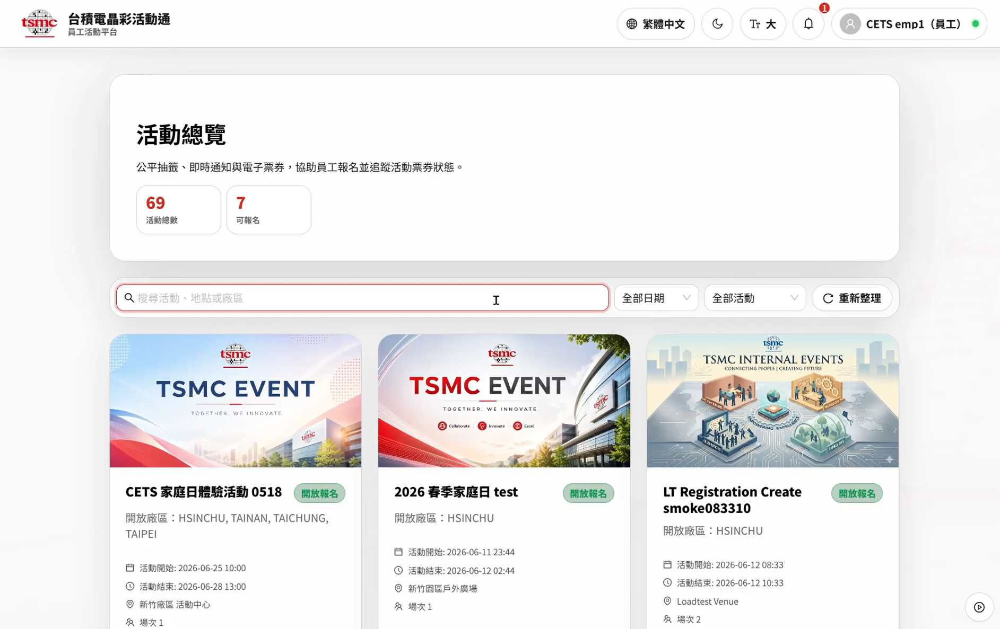
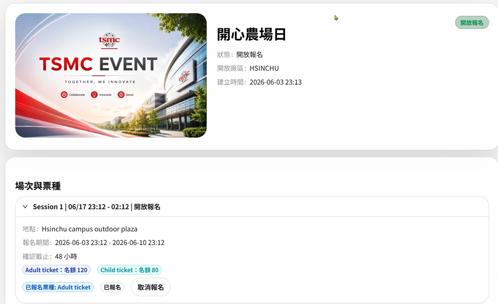
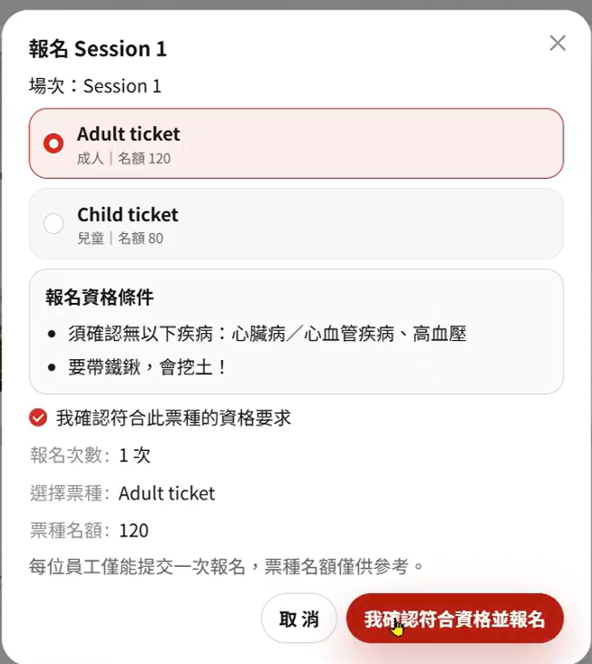
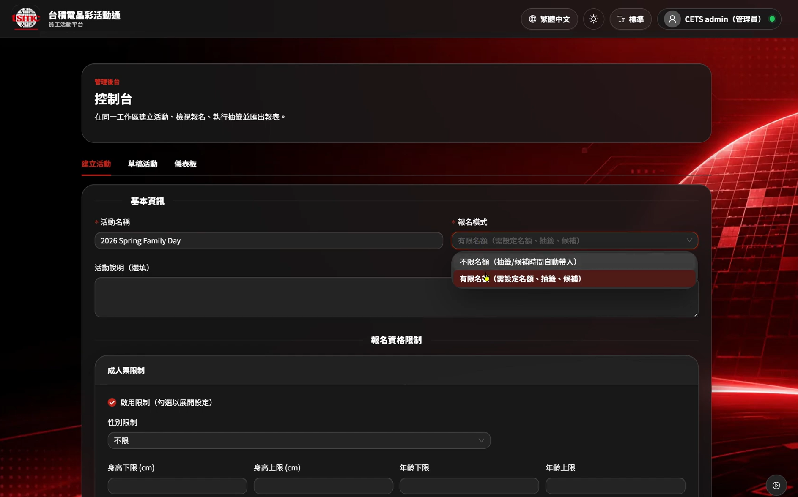
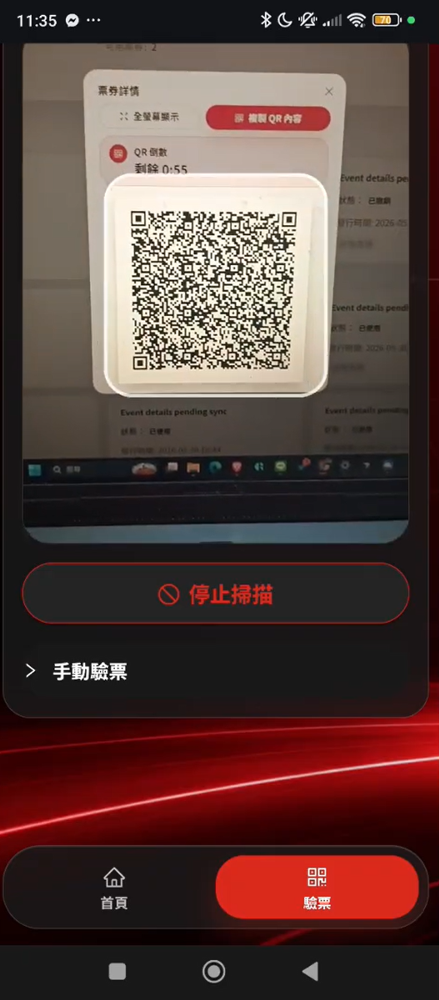

# CETS — 企業活動報名與驗票系統

**Corporate Event Ticketing System（CETS）** 是一套面向企業內部活動的完整解決方案，涵蓋活動發布、員工報名、抽籤配額、票券核銷與即時通知。前端提供員工、管理員、驗票員三種角色的操作介面；後端以 FastAPI 建構模組化 API，並針對雲端部署場景設計可觀測性、水平擴展與生產環境安全防護。

> 本儲存庫為 **Monorepo**，前後端原始碼、測試、CI/CD 與 SonarCloud 設定集中管理。

---

## 目錄

- [專案概覽](#專案概覽)
- [介面預覽](#介面預覽)
- [主要功能](#主要功能)
- [技術架構](#技術架構)
- [儲存庫結構](#儲存庫結構)
- [快速開始](#快速開始)
- [測試](#測試)
- [CI/CD 自動化](#cicd-自動化)
- [SonarCloud 程式碼品質](#sonarcloud-程式碼品質)
- [相關文件](#相關文件)
- [授權](#授權)

---

## 專案概覽

CETS 模擬大型企業舉辦內部活動時的實際流程：名額有限、需要公平抽籤、中籤後須在期限內確認、現場以 QR Code 驗票，並在關鍵節點推送通知給員工與管理員。

| 面向 | 說明 |
|------|------|
| **目標使用者** | 一般員工、活動管理員、現場驗票人員 |
| **部署方式** | 前端 GitHub Pages；後端 Kubernetes 叢集 |
| **API 前綴** | `/api/v1`（WebSocket 端點為 `/ws`） |
| **身分驗證** | Auth0 OIDC / OAuth 2.0 + JWT |

---

## 介面預覽

以下為 CETS 各角色實際操作畫面，方便快速了解系統長什麼樣子、各流程怎麼走。

### 員工端 — 活動總覽



*圖 1：員工登入後的活動總覽。可查看活動總數、可報名數量，並以卡片方式瀏覽各廠區活動，支援搜尋、日期與狀態篩選。*

### 員工端 — 活動詳情



*圖 2：單一活動詳情頁。顯示活動封面、開放廠區、場次時間、成人／兒童票種配額，以及員工目前的報名狀態與取消操作。*

### 員工端 — 報名確認



*圖 3：報名確認彈窗。員工選擇票種、閱讀資格條件並勾選確認後提交；每位員工僅能提交一次報名。*

### 管理員端 — 建立活動



*圖 4：管理後台「建立活動」頁面。可設定活動名稱、報名模式（不限名額／限額抽籤）、場次票種，以及成人票的年齡、身高、性別等資格限制。*

### 驗票端 — QR 掃描驗票



*圖 5：驗票員行動端介面。透過相機掃描動態 QR Code（含倒數計時防重放），亦可切換手動驗票；驗票成功或失敗會即時回饋。*

---

## 主要功能

### 員工端

- 瀏覽已發布活動、查看場次與票種配額
- 線上報名（每次提交建立一筆報名紀錄）
- 個人中心：報名狀態、中籤確認、票券與 QR Code
- 通知中心：WebSocket 即時推播、未讀計數、已讀管理

### 管理員端

- 活動建立、編輯、發布與取消
- 場次與票種配額管理
- 手動或排程觸發抽籤
- 儀表板、報名清單、各廠區員工人數
- 同步 / 非同步報表匯出（含 PII 遮罩）

### 驗票端

- QR Code 掃描核銷
- 裝置白名單與簽章驗證
- 驗票結果即時回饋

### 後端核心能力

- **確定性抽籤引擎**：Fisher-Yates 洗牌搭配 HMAC-SHA256 種子，相同輸入必得相同結果，支援稽核重播
- **即時通知**：Redis Pub/Sub 跨副本廣播 + WebSocket 推播（accept-then-auth 模式，避免 token 外洩）
- **排程任務**：報名逾期、候補遞補、抽籤 CronJob、匯出背景作業
- **稽核軌跡**：關鍵狀態變更寫入 audit log
- **生產級防護**：啟動 fail-fast 自檢、Rate Limit、Prometheus 指標、OpenTelemetry 追蹤

---

## 技術架構

```
┌─────────────────────────────────────────────────────────────┐
│  前端 (React 18 + Vite 5 + Ant Design 5)                    │
│  GitHub Pages 部署 · 角色路由 · WebSocket 通知               │
└──────────────────────────┬──────────────────────────────────┘
                           │ HTTPS / WSS
┌──────────────────────────▼──────────────────────────────────┐
│  後端 (FastAPI + Python 3.12)                               │
│  auth · event · registration · lottery · ticket · admin     │
│  notification · scheduler · metrics · audit                 │
└──────┬───────────────────────────────┬──────────────────────┘
       │                               │
┌──────▼──────┐                 ┌──────▼──────┐
│ PostgreSQL  │                 │    Redis    │
│ 讀寫分離     │                 │ 快取 / 限流  │
│ 主資料       │                 │ Pub/Sub     │
└─────────────┘                 └─────────────┘
```

### 前端

| 項目 | 技術 |
|------|------|
| 框架 | React 18、React Router v6 |
| 建置 | Vite 5 |
| UI | Ant Design 5、Recharts（管理端圖表） |
| 測試 | Vitest、Testing Library、Playwright（E2E） |
| QR | ZXing（掃描）、qrcode（產生） |

### 後端

| 項目 | 技術 |
|------|------|
| 框架 | FastAPI、Pydantic v2、SQLAlchemy 2（async） |
| 資料庫 | PostgreSQL（asyncpg） |
| 快取 / 訊息 | Redis |
| 排程 | APScheduler、K8s CronJob |
| 觀測 | structlog、Prometheus、OpenTelemetry |
| 安全 | PyJWT、Auth0 OIDC、cryptography（QR 簽章） |

### 角色與權限

| 角色 | 說明 |
|------|------|
| `EMPLOYEE` | 報名、查看個人票券與通知 |
| `ADMIN` | 完整管理操作 |
| `ADMIN_VIEWER` | 唯讀管理檢視 |
| `VERIFIER` | 現場驗票 |
| `DEPENDENT` | 後端相容角色（目前前端未啟用） |

---

## 儲存庫結構

```
cloud-native-final-team10/
├── frontend/                 # React 前端應用
│   ├── src/
│   │   ├── api/              # API 用戶端
│   │   ├── context/          # Auth、Notification 等全域狀態
│   │   ├── pages/            # 各頁面與管理端子元件
│   │   ├── components/       # 共用 UI 元件
│   │   └── styles/           # 全域與頁面樣式
│   ├── public/               # 靜態資源（背景圖、活動封面等）
│   └── sonar-project.properties
├── backend/                  # FastAPI 後端
│   ├── app/
│   │   ├── core/             # DB、Redis、middleware、metrics、security
│   │   └── modules/          # auth、event、registration、lottery、
│   │                         # ticket、admin、notification
│   ├── tests/
│   │   ├── unit/             # 單元測試
│   │   ├── integration/      # 整合測試
│   │   ├── e2e/              # 端對端測試
│   │   └── load/             # k6 負載測試腳本
│   └── sonar-project.properties
├── images/                   # README 介面截圖
├── .github/workflows/        # GitHub Actions CI/CD
├── SONAR_SETUP.md            # SonarCloud 詳細設定指南
└── QUALITY_AND_TEST_REPORT.md
```

---

## 快速開始

### 前置需求

- **Node.js** 20+（前端）
- **Python** 3.12+（後端）
- 可連線的 PostgreSQL 與 Redis（後端執行時）
- Auth0 或相容 OIDC 提供者（完整登入流程）

### 前端

```powershell
cd frontend
npm install
```

建立 `frontend/.env.local`：

```env
VITE_BASE_PATH=/
VITE_API_BASE_URL=https://cets.alanh.uk/api/v1
VITE_WS_BASE_URL=
```

> `VITE_API_BASE_URL` 需填完整 API base，前端**不會**自動補 `/api/v1`。  
> `VITE_WS_BASE_URL` 可留空，前端會依 API 位址推導 WebSocket 路徑。

```powershell
npm run dev      # 本機開發（預設 http://localhost:5173）
npm run build    # 生產建置
npm test -- --run
```

更完整的前端說明請參考 [`frontend/README.md`](frontend/README.md)。

### 後端

```powershell
cd backend
pip install -r requirements-dev.txt
```

設定必要的環境變數（資料庫、Redis、JWT 金鑰、Auth0 等），詳見 `backend/app/config.py`。

```powershell
$env:PYTHONPATH="."
pytest tests/unit -q
```

---

## 測試

### 前端

| 指令 | 說明 |
|------|------|
| `npm test -- --run` | 執行 Vitest 單元測試 |
| `npm run test:coverage` | 單元測試 + 覆蓋率（SonarCloud 使用） |
| `npm run test:e2e` | Playwright E2E 煙霧測試 |

### 後端

| 指令 | 說明 |
|------|------|
| `pytest tests/unit` | 單元測試 |
| `pytest tests/integration` | 整合測試 |
| `pytest tests/e2e` | 端對端測試 |
| `pytest tests/unit --cov=app --cov-report=xml` | 覆蓋率報告（SonarCloud 使用） |

---

## CI/CD 自動化

本專案使用 **GitHub Actions** 管理持續整合與部署，共三條 workflow：

### 1. 前端部署 — `frontend-deploy.yml`

| 項目 | 內容 |
|------|------|
| **觸發時機** | `main` / `master` 分支推送且 `frontend/**` 有變更；或手動觸發 |
| **流程** | 安裝依賴 → 驗證環境變數 → 單元測試 → 建置 → 上傳 GitHub Pages |
| **部署目標** | GitHub Pages |

**必要設定（Repository Variables）：**

| 變數 | 說明 |
|------|------|
| `VITE_API_BASE_URL` | 後端 API 完整 base URL（必填） |
| `VITE_WS_BASE_URL` | WebSocket base（選填） |
| `VITE_BASE_PATH` | Pages 子路徑（選填，預設 `/<repo-name>/`） |

### 2. SonarCloud 前端 — `sonarcloud-frontend.yml`

| 項目 | 內容 |
|------|------|
| **觸發時機** | `frontend/**` 變更的 push / PR；或手動觸發 |
| **流程** | `npm ci` → `npm run test:coverage` → SonarCloud 掃描 |

### 3. SonarCloud 後端 — `sonarcloud-backend.yml`

| 項目 | 內容 |
|------|------|
| **觸發時機** | `backend/**` 變更的 push / PR；或手動觸發 |
| **流程** | 安裝 Python 依賴 → `pytest tests/unit --cov=app` → SonarCloud 掃描 |

```
                    push / pull_request
                           │
           ┌───────────────┼───────────────┐
           ▼               ▼               ▼
   frontend-deploy   sonarcloud-      sonarcloud-
   (GitHub Pages)    frontend.yml     backend.yml
                           │               │
                           └───────┬───────┘
                                   ▼
                            SonarCloud 儀表板
```

---

## SonarCloud 程式碼品質

本專案在 **SonarCloud** 上以前後端**兩個獨立專案**進行程式碼品質分析，確保 Monorepo 中各元件的指標獨立追蹤、互不干擾。

| 元件 | Project Key | 設定檔 | CI Workflow |
|------|-------------|--------|-------------|
| 前端 | `elaine17016_cets_frontend` | `frontend/sonar-project.properties` | `sonarcloud-frontend.yml` |
| 後端 | `elaine17016_cets_backend` | `backend/sonar-project.properties` | `sonarcloud-backend.yml` |

**儀表板：**

- 前端：https://sonarcloud.io/project/overview?id=elaine17016_cets_frontend
- 後端：https://sonarcloud.io/project/overview?id=elaine17016_cets_backend

### SonarCloud 做了什麼？

每次 CI 執行時，SonarCloud 會：

1. 接收單元測試產生的**覆蓋率報告**（前端 lcov、後端 coverage.xml）
2. 進行**靜態程式碼分析**（Bug、漏洞、Code Smell、重複程式碼）
3. 依 **Quality Gate（品質閘）** 判定本次變更是否達標

Quality Gate 典型條件包含：新程式碼可靠性 / 安全性 / 可維護性評級、測試覆蓋率門檻、重複率上限、安全熱點審查率等。

### 一次性設定

1. 在 [SonarCloud](https://sonarcloud.io) 建立對應專案（Organization：`elaine17016`）
2. 於 GitHub Repository Secrets 新增 `SONAR_TOKEN`（SonarCloud Personal Access Token）
3. 推送程式碼或手動觸發 workflow 即可開始分析

詳細步驟與常見問題請參考 [`SONAR_SETUP.md`](SONAR_SETUP.md)。

---

## 相關文件

| 文件 | 說明 |
|------|------|
| [`frontend/README.md`](frontend/README.md) | 前端功能、API 設定與開發指南 |
| [`frontend/frontend-api.md`](frontend/frontend-api.md) | API 合約與請求/回應範例 |
| [`frontend/DESIGN_SYSTEM.md`](frontend/DESIGN_SYSTEM.md) | 前端設計系統與樣式規範 |
| [`SONAR_SETUP.md`](SONAR_SETUP.md) | SonarCloud 設定與本機驗證 |
| [`QUALITY_AND_TEST_REPORT.md`](QUALITY_AND_TEST_REPORT.md) | 品質與測試報告 |
| [`AGENTS.md`](AGENTS.md) | 專案狀態與 AI 協作備忘 |

---

## 授權

MIT License

---

## 關於本專案

本專案為 **Cloud Native 課程期末專案**（Team 10），展示從活動管理、公平抽籤、票券驗核到即時通知的完整企業級流程，並以 CI/CD 與 SonarCloud 確保程式碼品質可持續追蹤。

如有問題或建議，歡迎透過 GitHub Issues 提出。
